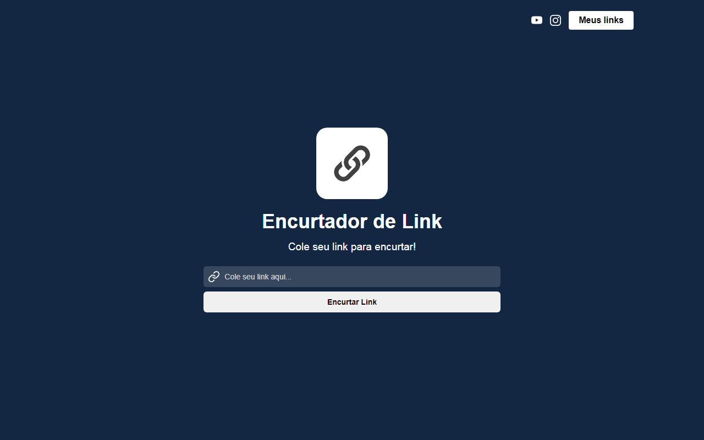
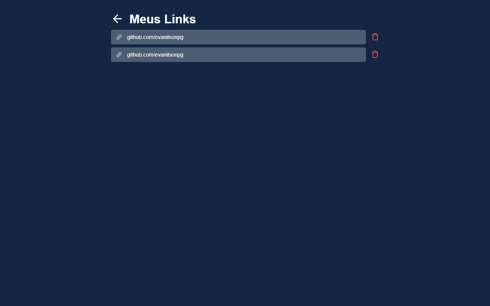
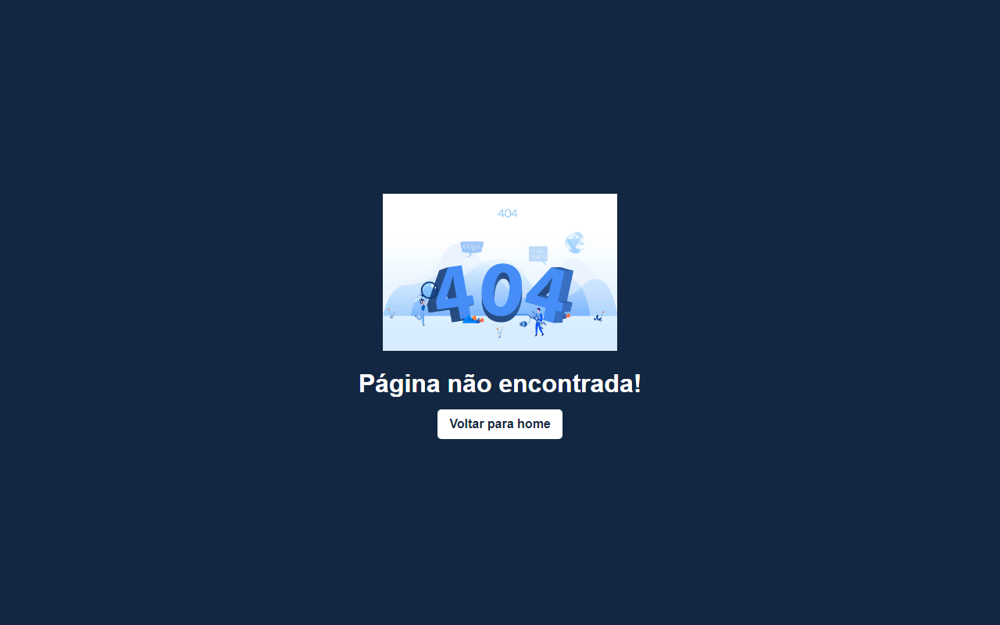

<h1 align='center'>Encurtador de Link</h1>

 

<h2 align='center'>Descrição</h2> 

**Encurtador de link** como o próprio nome diz, com ele é possivel está encurtando aqueles links grandes para um link mais pequeno!
Este projeto foi feito com **REACT** ultilizando uma **API** da **bitly** para está encurtando os links que o usuário desejar .

 

<h2 align='center'>Página 1</h2>

 Esse encurtador de link possui 3 páginas a primeira **'HOME'** é a parte inicial onde voce pode está colando o seu link para está sendo encurtado .
 

<h2 align='center'>Página 2</h2>

Na página 2 é onde fica todos os seus links ja encurtados! na parte superior é possivel está removendo alguns de seus links quando não os desejar mais .

 

<h2 align='center'>Página 3</h2>

Na página 3 possui apenas usa imagem **'404'** que por sinal serve apenas para iformar ao usuário que a página que ele procura não é existente .

 

### **Tecnologias usadas** -->
 

- [HTML]()
- [CSS]()
- [JAVASCRIPT]()
- [REACT]()
